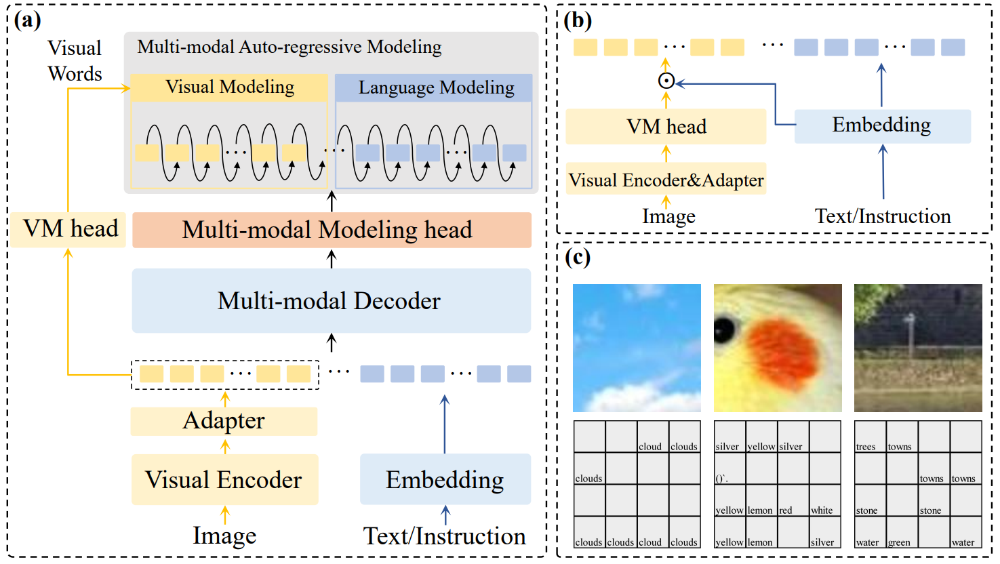

# Multi-modal Auto-regressive Modeling via Visual Words

[[`arXiv`](https://arxiv.org/abs/2403.07720)] [[`BibTeX`](#Citing)]

This is the official repository for the multi-modal large language models: **VW-LMM**

<div align="left">
  
</div><br/>

## Introduction
We propose **VW-LMM**, a large multi-modal model (LMM) that successfully performs multi-modal auto-regressive modeling with a unified objective for the first time.
Specifically, we propose the concept of visual words, which maps the visual features to probability distributions over LLM's vocabulary, providing supervision information for visual modelling.
We further explore the distribution of visual features in the semantic space within LMM and the possibility of using text embeddings to represent visual information.
Experimental results and ablation studies on 5 VQA tasks and 4 benchmark toolkits validate the powerful performance of our proposed approach.
For more technical details, please refer to our [paper](https://arxiv.org/abs/2403.07720).

<div align="center">
  
</div><br/>

In order to verify whether the visual words learnt by VW-LMM can realistically reflect the image information, we take VW-LMM-Vicuna-7B as an example to explore.
For each patch in the image, we select the token with the highest probability in its corresponding visual words, and compare the region of interest in the image with its visualisation result, visualization is as follows <strong>(Best viewed zoomed-in)</strong>: 

<div align="center">
  
</div><br/>

## Model Zoo

| **Version**       | **Size** | **Support pseudo image features** | **Checkpoint**                                                                        |
|-------------------|----------|-----------------------------------|---------------------------------------------------------------------------------------|
| VW-LMM-Vicuna     | 7B       |  False                            | [VW-LMM-Vicuna-7b](https://huggingface.co/MYTH-Lab/VW-LMM-Vicuna-7b)           |
| VW-LMM-Mistral    | 7B       |  False                            | [VW-LMM-Mistral-7b](https://huggingface.co/MYTH-Lab/VW-LMM-Mistral-7b)         |
| VW-LMM-Vicuna-pif | 7B       |  True                             | [VW-LMM-Vicuna-pif-7b](https://huggingface.co/MYTH-Lab/VW-LMM-Vicuna-pif-7b) |


VW-LMM, by constructing visual words to introduce visual supervisory information, achieves the best performance among models of the same scale of 7B, and obtains vision-language understanding capability competitive to or even surpassing that of 13B or even larger scale models.

| Methods                     | LLM       | Res. | VQA^v2 | GQA   | VisWiz | SQA^I | VQA^T | POPE  | MMB  | MMB^CN | MM-Vet |
|-----------------------------|-----------|------|--------|-------|--------|-------|-------|-------|------|--------|--------|
| *Language Modeling Method*  |           |      |        |       |        |       |       |       |      |        |        |
| IDEFICS-80B                 | LLaMA-65B | 224  | 60.0   | 45.2  | 36.0   | --    | 30.9  | --    | 54.5 | 38.1   | --     |
| InstructBLIP                | Vicuna-13B| 224  | --     | 49.5  | 33.4   | 63.1  | 50.7  | 78.9  | --   | --     | 25.6   |
| BLIP-2                      | Vicuna-13B| 224  | 41.0   | 41.0  | 19.6   | 61.0  | 42.5  | 85.3  | --   | --     | 22.4   |
| LLaVA-v1.5                  | Vicuna-13B| 336  | 80.0   | 63.3  | 53.6   | 71.6  | 61.3  | 85.9  | 67.7 | 63.6   | 35.4   |
| InstructBLIP                | Vicuna-7B | 224  | --     | 49.2  | 34.5   | 60.5  | 50.1  | --    | 36   | 23.7   | 26.2   |
| IDEFICS-9B                  | LLaMA-7B  | 224  | 50.9   | 38.4  | 35.5   | --    | 25.9  | --    | 48.2 | 25.2   | --     |
| Qwen-VL                     | Qwen-7B   | 448  | 78.8   | 59.3  | 35.2   | 67.1  | **63.8** | --    | 38.2 | 7.4    | --     |
| Qwen-VL-Chat                | Qwen-7B   | 448  | 78.2   | 57.5  | 38.9   | 68.2  | 61.5  | --    | 60.6 | 56.7   | --     |
| LLaVA-v1.5                  | Vicuna-7B | 336  | 78.5   | 62.0  | **50.0**| 66.8  | 58.2  | 85.9  | 64.3 | 58.3   | 30.5   |
| MoE-LLaVA-2.7B×4-Top2       | Phi-2-2.7B| 336  | 77.6   | 61.4  | 43.9   | 68.5  | 51.4  | 86.3  | 65.2 | --     | **34.3**|
| *Multi-modal Modeling Method*|           |      |        |       |        |       |       |       |      |        |        |
| Emu2-Chat                   | LLaMA-33B | 448  | 84.9   | 65.1  | 54.9   | 65.5  | 66.6  | --    | --   | --     | 48.5   |
| Emu-I                       | LLaMA-13B | 224  | 62.0   | 46.0  | 38.3   | --    | --    | --    | --   | --     | 36.3   |
| MM-Interleaved-SFT          | Vicuna-13B| 224  | 80.2   | 60.5  | 54.9   | --    | 61.0  | --    | --   | --     | --     |
| Unified-IO 2                |UIO-2-6.8B | 384  | **79.4**| --    | --     | **86.2**| --    | **87.7**| **71.5**| -- | --     |
| DreamLLM                    | Vicuna-7B | 224  | 56.6   | --    | 38.1   | --    | 34.9  | --    | --   | --     | --     |
| VL-GPT-I                    |LLaMA-7B   | 224  | 67.2   | 51.5  | 38.9   | --    | --    | --    | --   | --     | --     |
| LaVIT-v2                    | LLaMA2-7B | 224  | 68.3   | 47.9  | 41.0   | --    | --    | --    | --   | --     | --     |
| VW-LMM                      | Vicuna-7B | 336  | 78.9   | **62.7** | 48.3 | 68.1  | 57.6  | 85.9  | 65.9 | **59.8**| 31.3   |
| VW-LMM                      | Mistral-7B| 336  | **80.8**| **65.4** | **58.5** | **75.9**| **63.1**| **87.0**| **80.6**| **79.0** | **44.0**|

## Setup

### Requirements

```shell
git clone https://github.com/pengts/VW-LMM.git
cd VW-LMM
pip install -r requirements.txt
```

## Multi-modal Inference

### Model Configurations

- VW-LMM-Vicuna
```python
model_path="VW-LMM-Vicuna"
conv_mode="vicuna_v1"
model_base="llama"
device = "cuda"
```
- VW-LMM-Mistral
```python
model_path="VW-LMM-Mistral"
conv_mode="mistral"
model_base="mistral"
device = "cuda"
```

VW-LMM-Vicuna-pif
```python
model_path="VW-LMM-Vicuna-pif"
conv_mode="vicuna_v1"
model_base="llama"
device = "cuda"
```

### Model Initialization
```python
disable_torch_init()
model_path = os.path.expanduser(model_path)
model_name = get_model_name_from_path(model_path)
tokenizer, model, image_processor, context_len = load_pretrained_model(model_path, model_name, model_base,device=device)
```

### Input Processing
```python
question="Write an exhaustive depiction of the given image."
image_path="./example.jpg"
qs = question
qs = DEFAULT_IMAGE_TOKEN + '\n' + qs
conv = conv_templates[conv_mode].copy()
conv.append_message(conv.roles[0], qs)
conv.append_message(conv.roles[1], None)
prompt = conv.get_prompt()

image = Image.open(image_path).convert('RGB')
image_tensor = process_images([image], image_processor, model.config)[0].unsqueeze(0).to(device)
input_ids = tokenizer_image_token(prompt, tokenizer, IMAGE_TOKEN_INDEX, return_tensors='pt').unsqueeze(0).to(device)
```

### Inference
```python
with torch.inference_mode():
    output_ids = model.generate(
        input_ids,
        images=image_tensor.to(dtype=torch.float16, device=device, non_blocking=True),
        do_sample= False,
        temperature=0,
        top_p=None,
        num_beams=1,
        max_new_tokens=128,
        use_cache=True)

input_token_len = input_ids.shape[1]
n_diff_input_output = (input_ids != output_ids[:, :input_token_len]).sum().item()
if n_diff_input_output > 0:
    print(f'[Warning] {n_diff_input_output} output_ids are not the same as the input_ids')
outputs = tokenizer.batch_decode(output_ids[:, input_token_len:], skip_special_tokens=True)[0]
outputs = outputs.strip()
print(outputs)
```

## Acknowledgement
We are grateful for the following awesome projects when implementing VW-LMM:
* [LLaVA](https://github.com/haotian-liu/LLaVA/): Visual instruction tuning towards large language and vision models with GPT-4 level capabilities.
* [LLaMA](https://github.com/facebookresearch/llama): Open and Efficient Foundation Language Models
* [Vicuna](https://github.com/lm-sys/FastChat): Open-source LLM with amazing language capabilities!
* [Mistral](https://huggingface.co/mistralai/Mistral-7B-Instruct-v0.2): A 7B transformer model, fast-deployed and easily customisable. Small, yet very powerful for a variety of use cases.


## <a name="Citing"></a>Citation
Consider giving this repository a star and cite VW-LMM in your publications if it helps your research.

```
@misc{peng2024multimodal,
      title={Multi-modal Auto-regressive Modeling via Visual Words}, 
      author={Tianshuo Peng and Zuchao Li and Lefei Zhang and Hai Zhao and Ping Wang and Bo Du},
      year={2024},
      eprint={2403.07720},
      archivePrefix={arXiv},
      primaryClass={cs.CV}
}
```
